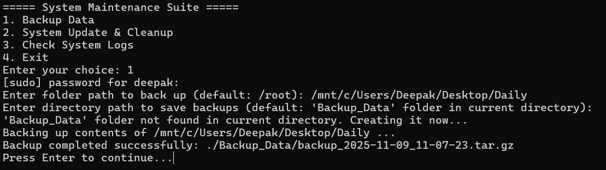
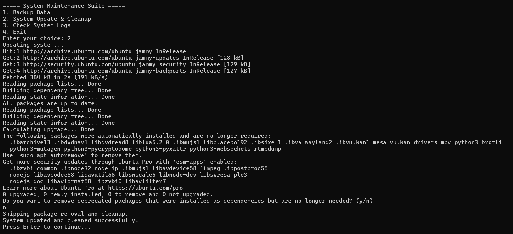
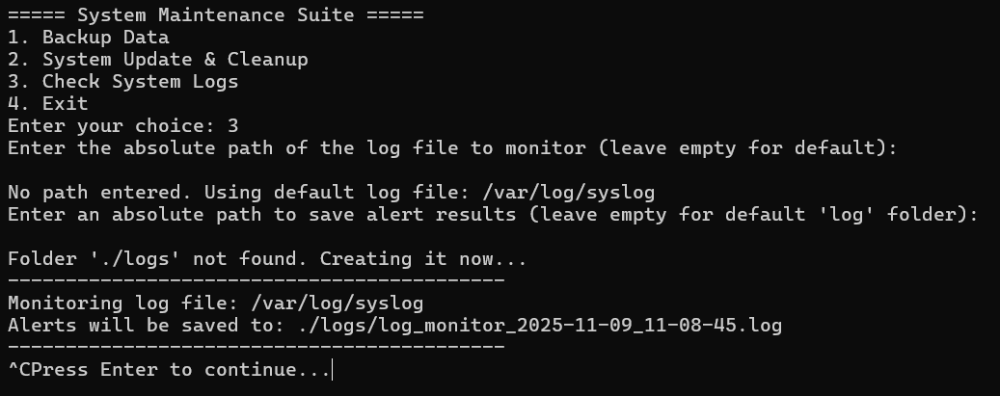

# Bash Scripting Suite For System Maintenance

## Overview

The **Bash System Maintenance Suite** is a menu-driven automation project for Linux system maintenance. It simplifies routine tasks like automated backups, system updates, cleanup, and log monitoring, providing a user-friendly interface for administrators. The suite is designed to save time and reduce errors by automating essential system administration tasks. Its modular structure allows easy customization and extension to accommodate different maintenance needs and environments.

## Features

1. **System Backup**
   - Prompts user for file/folder path to back up
   - Confirms before creating backup
   - Saves compressed `.tar.gz` files in `Backup_Data`
   - If any error occures while creating `.tar.gz` files it also saves error log files inside Backup_Data
   - Logs actions in `logs/backup_error_YYYY-MM-DD_HH-MM-SS.log`
   - Prompts user for Folder path to save backup files/folders
   - By default it creates folder "Backup_Data" in current directory and save output backup files in that Folder
     
2. **System Update & Cleanup**
   - Updates package lists and upgrades installed packages
   - Optionally removes deprecated packages and cleans cache
   - Confirms before removing deprecated packages and cleaning cache
   - Handles errors gracefully like network issue , Resolve package conflicts etc
     
3. **Log Monitoring**
   - Scans `/var/log/syslog` for errors, warnings, critical messages, or failures
   - saves Logs activities in `logs/log_monitor_DATE.log(log_monitor_2025-11-09_10-30-00.log)`
   - Each log file entry includes timestamps and message severity to help prioritize incident response
     
4. **Menu-Based Automation**
   - Interactive menu to run all scripts
   - Validates input and provides feedback

---

## Project Structure

<pre class="not-prose w-full rounded font-mono text-sm font-extralight">

text

<code>Bash_Scripting_Suite_For_System_Maintenance/
 ├─ Scripts/
 │   ├─ Backup_Data.sh        # Automated backup
 │   ├─ Update_Clean.sh       # System update and cleanup
 │   ├─ Log_Monitoring.sh     # Log monitoring
 ├─ Maintenance_Suite.sh    # Main menu interface
 ├─ .gitignore/                       # Specifies intentionally untracked files to ignore in Git
 ├─ README.md/                # Project overview, Usage instructions, and documentation 
 └─ LICENSE/                      # License information for the project
</code>

</pre>

---

## Installation & Setup

1. Clone the repository:

<pre class="not-prose w-full rounded font-mono text-sm font-extralight">

bash

<code>git clone https://github.com/Deepak-Kumar-784/Bash-Scripting-Suite-for-System-Maintenance-.git
cd Bash_Scripting_Suite_For_System_Maintenance
</code>

</pre>

2. Open in VS Code:

<pre class="not-prose w-full rounded font-mono text-sm font-extralight">

bash

<code>code .
</code>

</pre>

3. Create or edit the scripts in the `Scripts/` folder and paste the respective code.
4. Make scripts executable:

<pre class="not-prose w-full rounded font-mono text-sm font-extralight">

bash

<code>chmod +x Scripts/*.sh Maintenance_Suite.sh
</code>

</pre>

---

## Usage

Run the main menu:

<pre class="not-prose w-full rounded font-mono text-sm font-extralight">

bash

<code>./Maintenance_Suite.sh
</code>

</pre>

Menu options:

- `1` → Run Backup
- `2` → System Update & Cleanup
- `3` → Monitor System Logs
- `4` → Exit

Follow on-screen prompts for each task.

---

## Logging

- `logs/log_monitor_CURRENT_DATE.log` → Backup activities

---

## Requirements

- Linux OS (Ubuntu recommended)
- Bash shell
- Utilities: `tar`, `grep` , `apt , tail , read , date `
- `sudo` privileges for system updates and cleanup
